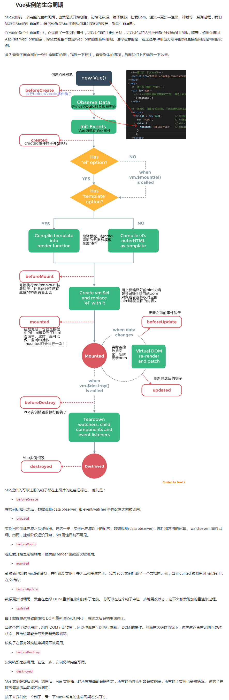

# vue 过滤器的使用

### 1.Vue.filter()

```html
 <p>合计:{{allPrice|test("¥")}}</p> 在变量后面加| 
```

```js
// 使用过滤器,保存俩位小数,val是allprice变量的值
Vue.filter("test",(val,mark)=>{
    //注意: 使用toFixed的时候,必须是数值,不能是字符串
    return mark+(val.toFixed(2))
})
```

#### (1)第一种用法

```js
// <li v-for="(item,index) in list">{{item.name |test1}} </li> 在后面加|是调用的意思

Vue.filter("test1",(val)=>{
    console.log(val);
    //王建林 小哥  小仙女  注意:必须要有return值,页面才会显示值
    return val   
})
```

#### (2)第二种用法

```js
 // val可以加""字符串后面加值
    Vue.filter("test2",(val)=>{
        if (val=="王建林") {
            return val+"土豪"; //返回值为王建林土豪
        }
        return val;
    })
```

#### (4)用来限制字数,超出个数用...代替   **过滤器串联**

```js
//   <li v-for="(item,index) in list"> {{item.name |test2|setStr(4)}} </li>
// 设置允许字数,在超过字数之后就用三个点代替,同时可以和test2一起使用,通过传参数num来控制字数
Vue.filter("setStr",(val,num)=>{
    var str="";
    if (val.length>=num) {
        str=val.slice(0,num)+"...";
    }else{
        return str=val;
    }
    return str;
})
```

### 2.小留言板的制作

```html
<div id="app">
    <input type="text" v-model="uname">
    <input type="text" v-model="usay">
    <button @click="send">send</button>
    <button @click="del">删除</button>
    <button @click="delAll">全删</button>
    <ul>
        <li v-for="(item,index) in dataList">
            <h1>{{item.name}}</h1>
            <p>{{item.say}}</p>
            <input type="checkbox" v-model="item.bool">
        </li>
    </ul>
</div>
```

```js
new Vue({
    el: "#app",
    data: {
        uname: "",
        usay: "",
        dataList: []
    },
    methods: {
        send() {
            // 利用一个变量去接收一个对象
            let tmpObj = { name: this.uname, say: this.usay, bool: false }
            // 把所得到的数据push到dataList中
            this.dataList.push(tmpObj);
            this.uname = "";
            this.usay = "";
        },
        del() {
            // 利用一个空的数组去接收不删除的对象,再把剩下的arr赋值给dataList,就会保存不删除的值.删除要删除的值
            let arr = [];
            // 遍历dataList中的数据,如果bool值为false的话就把不删除的值放入数组中
            this.dataList.map((item) => {
                if (!item.bool) {
                    arr.push(item);
                }
            })
            // 把剩下不删除的数组赋值给dataList,就会删除了bool值为true的值
            this.dataList = arr;
            console.log(this.dataList);
        },
        delAll() {
            this.dataList = [];
        }
    },

})
```

# vue 生命周期

从开始到结束的过程,有一个生命周期在控制,每一个生命生命周期都有一个钩子函数,钩子函数会自动执行,

1.从vue实例初始之前beforeCreate到初始化created

2.初始化完成为渲染视图,可以拿到data中的数据

3.beforeMount视图渲染之前,变量还没有被解析

4.Mounted视图渲染,变量会被解析,渲染到页面 则mouted视图渲染之前,都只会渲染一次

5. beforeUpdate数据更新之前,要等数据发生变化
6.  updated数据更新,一旦触发事件,开始更新到更新完毕
7. 数据新渲染  渲染多次  数据渲染是异步 所以会先打印  console.log(this.$refs.aaa.innerText);打印hello;因为数据渲染之后数据会有变化,所以如果直接打印的话,就会拿不到最新的数据,就要拿
8. 数据销毁之前到数据销毁之后 如果执行数据销毁,后面的数据更新就不会被执行
9. 如果要拿到数据更新渲染之后的数据,视图渲染是一个异步的过程,那就必须在渲染完毕之后来获取值,利用函数this.$nextTick(() => {})在视图渲染完之后执行
            

```js
// 从开始到结束的过程,有一个生命周期在控制
//每一个生命生命周期都有一个钩子函数,钩子函数会自动执行
new Vue({
    el: "#app",
    data: {
        msg: "hellow"
    },
    beforeCreate() {
        // vue实例,初始化之前
        console.log(this.$el); //undefined
        console.log(this.$data); //undefined  
    },
    created() {
        //c初始化完成为渲染视图
        console.log("初始化的时候");

        console.log(this.$el); //undefined
        console.log(this.$data);  // 可以读到data中的
    },
    beforeMount() {
        console.log("视图模板渲染之前,变量还没有被解析");
        console.log(this.$el);//{{msg}}中的状态还未被解析,{{msg}}就还还被渲染到页面
        console.log(this.$data); //获取数据
    },
    mounted() {
        //视图渲染完毕,变量解析,渲染到html中
        //还可以在这个生命周期,发送ajax
        console.log("视图模板渲染完毕");
        console.log(this.$el);//{{msg}}就会被解析渲染到页面
        console.log(this.$data);//将数据中msg渲染到页面
        //异步
    },
    //在这之前初始化一次
    //数据新渲染  渲染多次  数据渲染是异步 所以会先打印  console.log(this.$refs.aaa.innerText);打印hello;因为数据渲染之后数据会有变化,所以如果直接打印的话,就会拿不到最新的数据,就要拿
    beforeUpdate() {
        //数据更新之前
        console.log("数据更新之前")
    },
    updated() {
        console.log("更新完毕")
    },
    beforeDestroy() {
        console.log("组件销毁之前")
    },
    destroyed() {
        console.log("组件销毁之后")
    },
    methods: {
        test() {
            //this.$destroy();  //后面的就不会执行了
            this.msg = "哈哈哈"
            //在视图渲染之后执行,视图渲染是一个异步的过程
            this.$nextTick(() => {
                console.log(console.log(this.$refs.aaa.innerText));

            })

        }
    },
})
```

